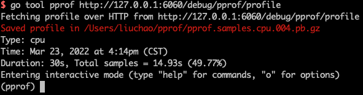

# 使用方式

### 非 web
`runtime/pprof`

**可以使用 `github.com/pkg/profile` 这个包代替，更方便易用**

### web
`net/http/pprof`

**使用这个包的时候，不进行取样不会影响程序性能**

### 示例

```go
package main

import (
	"log"
	"net/http"
	_ "net/http/pprof" // 会自动注册 handler 到 http server，方便通过 http 接口获取程序运行采样报告
	"runtime"
)

func main() {
	runtime.SetMutexProfileFraction(1) // 开启对锁调用的跟踪
	runtime.SetBlockProfileRate(1)     // 开启对阻塞操作的跟踪

	if err := http.ListenAndServe(":6060", nil); err != nil {
		log.Fatal(err)
	}
}
```
在浏览器中打开 `http://127.0.0.1:6060/debug/pprof/` 查看总览信息

| 类型         | 描述                                                                                                    |
| ------------ | ------------------------------------------------------------------------------------------------------- |
| allocs       | 所有内存分配信息                                                                                        |
| blocks       | 阻塞操作的堆栈信息                                                                                      |
| cmdline      | 启动命令和参数                                                                                          |
| goroutine    | 当前所有协程堆栈信息。参数 debug=1/debug=2 切换显示信息                                                 |
| heap         | 堆内存使用信息                                                                                          |
| mutex        | 锁竞争信息                                                                                              |
| profile      | CPU 使用信息，每10ms中断一次进行采样，会下载文件。参数 seconds=30 指定采样时间，使用 go tool pprof 分析 |
| threadcreate | 系统线程创建信息                                                                                        |
| trace        | 程序运行跟踪信息，会下载文件。参数 seconds=30 指定采样时间，使用 go tool trace 分析                     |


# 利用 pprof 排查问题

- 一般使用浏览器快速观察指标异常，基于命令行工具进行具体指标分析

- top 命令指标含义:
  
| 类型  | 描述                                               |
| ----- | -------------------------------------------------- |
| flat  | 该函数消耗 `值`                                    |
| flat% | 该函数消耗 `值` 的百分比                           |
| sum%  | top 命令中排在它上面的函数以及本函数的 flat% 之和  |
| cum   | 该函数加上该函数调用的函数的累计消耗 `值`          |
| cum%  | 该函数加上该函数调用的函数的累计消耗 `值` 的百分比 |

- 安装图形化需要的依赖: [graphviz](https://graphviz.gitlab.io/download/)


## 排查 CPU 问题

1. 执行命令获取分析文件, 进入交互式终端
    ```
    // 默认取样 30s
    go tool pprof http://127.0.0.1:6060/debug/pprof/profile

    // 指定取样 10s
    go tool pprof http://127.0.0.1:6060/debug/pprof/profile?seconds=10
    ```
    
    

    **注意文件保存位置，在服务器上操作后可以下载到本地进行可视化分析**

2. 输入 `top` 命令，查看 CPU 占用过高的调用
    
    

3. 输入 `list 关键词` 命令，查看问题代码
    
    

4. 输入 `web` 命令，查看调用关系图 (生成一个.svg文件，并调用系统默认浏览器打开)
    
    

5. 使用可视化页面查看火焰图, 同时可以看到所有以上步骤的信息 (使用默认浏览器打开一个 web 页面)
   ```
   // 有两种方式可以打开可视化页面
   // 事先在 http://127.0.0.1:6060/debug/pprof/ 页面点击 profile 下载文件
   go tool pprof -http=:6061 ~/Downloads/profile

   // 没有下载文件
   go tool pprof -http=:6061 http://127.0.0.1:6060/debug/pprof/profile

   ```

    

## 排查内存问题
  
1. 内存占用
    ```
    // 命令行
    go tool pprof http://127.0.0.1:6060/debug/pprof/heap

    // 可视化页面
    go tool pprof -http=:6061 http://127.0.0.1:6060/debug/pprof/heap
    go tool pprof -http=:6061 文件路径
    ```

2. 内存频繁申请和回收
    ```
    // 命令行
    go tool pprof http://127.0.0.1:6060/debug/pprof/allocs

    // 可视化页面
    go tool pprof -http=:6061 http://127.0.0.1:6060/debug/pprof/allocs
    go tool pprof -http=:6061 文件路径
    ```
3. 对比
    ```
    // 通过此命令可以以 a 为基准，对比 b 和 a，可以用来发现内存增长的情况
    go tool pprof -base a b
    ```

* 这两个指标记录的是堆内存的分配情况和调用栈信息，并不是完整的内存情况
* 默认每1000次堆内存分配执行一次采样记录
* heap/allocs 使用可视化页面命令获取的数据是一样的，通过点击SAMPLE->alloc_space/inuse_space可以切换

## 排查 goroutine 问题

1. 在 `http://127.0.0.1:6060/debug/pprof/` 页面中点击 goroutine 查看, 修改URL参数 `?debug=2` 查看更详细信息

2. 使用 go tool pprof 查看
    ```
    // 命令行
    go tool pprof http://127.0.0.1:6060/debug/pprof/goroutine

    // 可视化页面
    go tool pprof -http=:6061 http://127.0.0.1:6060/debug/pprof/goroutine
    go tool pprof -http=:6061 文件路径

    // 通过此命令可以以 a 为基准，对比 b 和 a，可以用来发现 goroutine 增长的情况
    go tool pprof -base a b
    ```

## 排查锁的问题
```
// 命令行
go tool pprof http://127.0.0.1:6060/debug/pprof/mutex

// 可视化页面
go tool pprof -http=:6061 http://127.0.0.1:6060/debug/pprof/mutex
go tool pprof -http=:6061 文件路径
```

## 排查阻塞问题
```
// 命令行
go tool pprof http://127.0.0.1:6060/debug/pprof/block

// 可视化页面
go tool pprof -http=:6061 http://127.0.0.1:6060/debug/pprof/block
go tool pprof -http=:6061 文件路径
```

## trace 分析
以 k8s 中运行的服务为例:
```
// 把pod的 8080 端口映射到本地 6060 端口
kubectl port-forward pod/usercenter-77b8c9d65f-22z6s 6060:8080

// 获取 trace 文件
curl http://127.0.0.1:6060/debug/pprof/trace?seconds=10 > trace.out

// 打开分析页面
go tool trace trace.out

// 可用指标
View trace：查看跟踪
Goroutine analysis：Goroutine 分析
Network blocking profile：网络阻塞概况
Synchronization blocking profile：同步阻塞概况
Syscall blocking profile：系统调用阻塞概况
Scheduler latency profile：调度延迟概况
User defined tasks：用户自定义任务
User defined regions：用户自定义区域
Minimum mutator utilization：最低 Mutator 利用率
```


